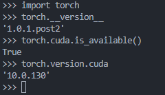
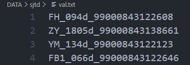
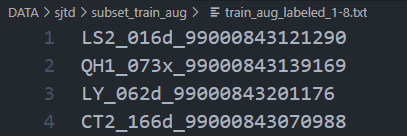
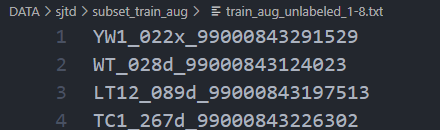

# 环境配置
1. 克隆代码
    ```sh
    $ git clone https://github.com/charlesCXK/TorchSemiSeg.git
    $ cd TorchSemiSeg
    ```
2. 创建Anaconda环境
    - 这里并不一定要按照官方README代码里那样安装semiseg.yaml的依赖，很多其实没有用到，我们安装我们需要的即可
    ```sh
    $ conda create -n pt10 python=3.7
    $ conda activate pt10
    ```
    - 安装pytorch，注意点
    1. TorchSemiSeg依赖里pytorch版本是1.0.0,那我们也安装1.0版本
    2. 注意查看Cuda compiler driver,服务器上是10.0
        ```sh
        $ nvcc -V
        ```
        
    3. 安装cudatoolkit为10.0版本的pytorch
        ```sh
        $ conda install pytorch==1.0.1 torchvision==0.2.2 cudatoolkit=10.0 -c pytorch
        ``` 
    4. 查看是否安装正确
        ```python
        import torch
        print(torch.__version__)
        print(torch.cuda.is_available())
        print(torch.version.cuda)
        ```
          
        可以看出我们安装的torch的cuda版本与cuda compiler driver版本是一致的
3. 安装apex
   - 直接安装apex, 不必按照官方文档，先安装依赖再安装apex
   ```sh
   $ git clone https://github.com/NVIDIA/apex
   $ cd apex
   ```
   - 安装apex依赖
   ```sh
   $ python -m pip install -r requirements.txt
   ```
   - 切换代码的分支(重要！！！)
   ```sh
   $ git checkout f3a960f80244cf9e80558ab30f7f7e8cbf03c0a0
   ```
   - 安装apex
   ```sh
   $ pip install -v --no-cache-dir --global-option="--cpp_ext" --global-option="--cuda_ext" ./
   ```
4. 最后安装TorchSemiseg运行所需的一些依赖，主要是semiseg.yaml里pip的内容
    ```sh
    $ python -m pip install easydict==1.9
    $ python -m pip install opencv-python==4.2.0.34
    $ python -m pip install pbkdf2==1.3
    $ python -m pip install protobuf==3.12.2
    $ python -m pip install scipy==1.5.0
    $ python -m pip install tensorboardx==1.6
    $ python -m pip install torchsummary==1.5.1
    ```
# 数据准备
- 在DATA下建立SJTD数据集的相关文件夹
  ```sh
  $ cd DATA
  $ mkdir sjtd
  $ mkdir val && mkdir val/image && mkdir val/label
  $ mkdir train_aug && mkdir train_aug/image && mkdir train_aug/label
  $ mkdir subset_train_aug
  ```
- 划分训练集(0.8)与测试集(0.2)
- 测试集的图片和标签分别放在val/image 和 val/label下
- 将测试集所有图片名称(不带扩展名)存储到val.txt文件里  

- 训练集的图片和标签分别放在train_aug/image 和 train_aug/label下
- 将训练集所有图片名称(不带扩展名)存储到train_aug.txt里  

- 划分训练时的有标签图片和无标签图片
- 例如有标签图片为训练集的1/8
- 随机从训练集里抽取1/8的图片，作为有标签数据，把他们的图片名放在subset_train_aug/train_aug_labeled_1-8.txt里，剩余图片放在subset_train_aug/train_aug_ublabeled_1-8.txt里  
  
  
# 训练
- 为我们的数据训练专门建立一个文件夹
```sh
$ mv exp.voc exp.sjtd
$ cd exp.sjtd/voc8.res50v3+.CPS
```
- 修改配置文件config.py
```python
C.dataset_path = osp.join(C.volna, 'DATA/sjtd') # 数据集路径
C.labeled_ratio = 8     # 有标签数据的占比
# 类别
C.num_classes = 5
C.background = 0

# 训练图片大小
C.image_height = 1024 
C.image_width = 512

C.num_train_imgs = 6766 // C.labeled_ratio # 有标签数据的图片数量
C.num_eval_imgs = 1680 # 测试图片数量
C.num_unsup_imgs = 6766 - C.num_train_imgs # 无标签数据的数量
```
- 修改dataloader.py
```python
@classmethod
def get_class_colors(*args):
    def uint82bin(n, count=8):
        """returns the binary of integer n, count refers to amount of bits"""
        return ''.join([str((n >> y) & 1) for y in range(count - 1, -1, -1)])

    N = 5 # 类别数

# 类别名称
@classmethod
def get_class_names(*args):
    return ['0', '1', '2', '3', '4']
```
- 修改script.sh
```sh
#!/usr/bin/env bash
nvidia-smi

export volna="/data/zhengxiaolong/TorchSemiSeg/"
export NGPUS=2
export OUTPUT_PATH="/data/zhengxiaolong/TorchSemiSeg/SJTD5labels"
export snapshot_dir=$OUTPUT_PATH/snapshot


export batch_size=2
export learning_rate=0.0025
export snapshot_iter=1

CUDA_VISIBLE_DEVICES=0,1 python -m torch.distributed.launch --nproc_per_node=$NGPUS train.py --port 21008
```
- 训练
```sh
$ bash script.sh
```
# 测试与图片预测
- 修改script.sh
```sh
#!/usr/bin/env bash
nvidia-smi

export volna="/data/zhengxiaolong/TorchSemiSeg/"
export NGPUS=2
export OUTPUT_PATH="/data/zhengxiaolong/TorchSemiSeg/SJTD5labels"
export snapshot_dir=$OUTPUT_PATH/snapshot


export batch_size=2
export learning_rate=0.0025
export snapshot_iter=1

export TARGET_DEVICE=$[$NGPUS]
CUDA_VISIBLE_DEVICES=0,1 python eval.py -e 25-34 -d 0-$TARGET_DEVICE --save_path $OUTPUT_PATH/results
```
- 测试
```sh
$ bash script.sh
```

